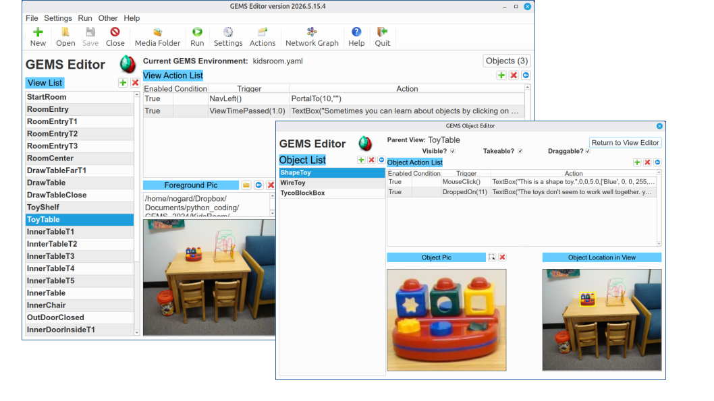
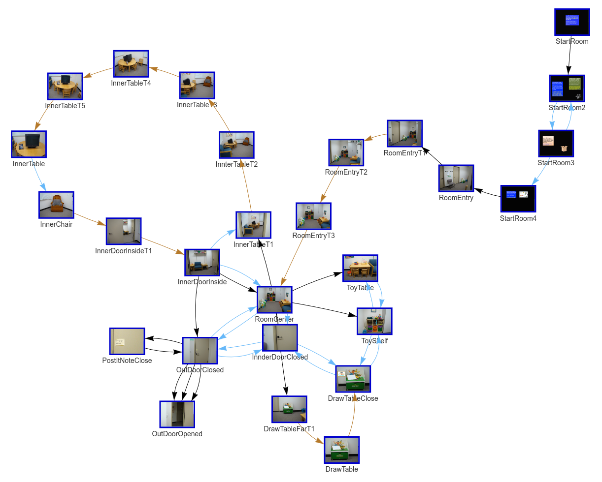

# GEMSedit -- Graphical Environment Management System Editor

**Author:** Travis L. Seymour, PhD
**License:** GPLv3
**Python:** 3.11 -- 3.14

## Overview

GEMSedit is a desktop application for authoring and editing interactive virtual environments built on the GEMS (Graphical Environment Management System) framework. GEMS environments are composed of interconnected views (scenes depicted by static images), interactive objects within those views, and a flexible event system of triggers, conditions, and actions that govern user interactions. GEMS was inspired by the 1993 adventure videogame [Myst](https://en.wikipedia.org/wiki/Myst) by Rand and Robyn Miller of Broderbund Software. 

> Note: GEMSedit is meant to be used in conjunction with [GEMSrun](https://www.github.com/travisseymour/GEMSrun), which must be installed separately.

With GEMSedit, designers can:

- Define views using foreground and background images to create layered scenes.
- Create interactive objects as rectangular regions within views.
- Specify triggers (mouse clicks, key presses, timers, drag-and-drop), conditions (variable checks, elapsed time), and actions (portal to another view, play audio, show/hide objects, set variables, and more).
- Design drag-and-drop interactions between objects, including pocket-based object transport across views.
- Configure global environment settings such as start view, pocket count, display mode, hover behavior, and overlays.
- Visualize the environment structure as an interactive network graph.
- Launch and test environments directly from the editor, with optional data recording and debug mode.

### GEMS View and Object Editors

[](gemsedit/resources/gems_ui_overview.png)

### GEMS Environment Network Graph

[](gemsedit/resources/gems_network_graph.png)

## Features

- **View Management** -- Create, edit, and delete views with foreground, background, and overlay images.
- **Object Editor** -- Define rectangular interactive regions within views, with properties for visibility, draggability, and takeability.
- **Action System** -- Attach triggers, conditions, and actions at the environment, view, or object level. Supports mouse clicks, key presses, timers, drag-and-drop interactions, and more.
- **Interactions** -- Define what happens when one object is dragged onto another, enabling rich interactive scenarios (e.g., dragging a key onto a locked door).
- **Environment Variables** -- Set, check, and delete runtime state variables to create conditional logic within environments.
- **Pockets** -- Allow users to pick up objects and carry them between views using configurable pocket slots.
- **Image Overlays** -- Overlay images on views for HUDs, maps, or contextual information.
- **Global Actions** -- Define actions that apply across all views, such as environment-wide timers or key bindings.
- **Network Graph** -- Visualize the connections between views as an interactive directed graph.
- **Environment Launcher** -- Run environments directly from the editor with options for user ID tracking, data recording, media toggling, and debug mode.
- **Auto-Save** -- All changes are saved to the environment database immediately.
- **Recent Files** -- Quickly reopen previously edited environments.
- **Update Checking** -- Check for new versions from GitHub.
- **Cross-Platform** -- Runs on Linux, macOS, and Windows.

## Installation

GEMSedit is distributed as a Python package and is best installed using [UV](https://docs.astral.sh/uv/), a fast Python package and project manager.

### Installing UV

UV is the recommended tool for installing and managing GEMSedit. Install it by following the instructions at [https://docs.astral.sh/uv/getting-started/installation/](https://docs.astral.sh/uv/getting-started/installation/).

For example, on Linux or macOS:

```bash
curl -LsSf https://astral.sh/uv/install.sh | sh
```

On Windows:

```powershell
powershell -ExecutionPolicy ByPass -c "irm https://astral.sh/uv/install.ps1 | iex"
```

### Installing GEMSedit

Once UV is installed, install GEMSedit as a tool:

```bash
uv tool install gemsedit
```

This makes the `gemsedit` (or `GEMSedit`) command available system-wide.

**Note for Linux users:** If you encounter a PySide6 xcb plugin error, install the required system library:

```bash
sudo apt install libxcb-cursor0
```

### Updating GEMSedit

To update to the latest version:

```bash
uv tool upgrade gemsedit
```

### Uninstalling GEMSedit

To remove GEMSedit:

```bash
uv tool uninstall gemsedit
```

## Usage

Launch the editor from the command line:

```bash
gemsedit
```

### Desktop Launcher

On supported platforms, you can install a desktop launcher (application shortcut):

```bash
gemsedit launcher --install
```

To remove the desktop launcher:

```bash
gemsedit launcher --uninstall
```

### Creating a New Environment

1. Click the **New** button in the toolbar.
2. Choose a location and name for your environment (no file extension needed).
3. GEMSedit creates a new environment with default start and end views.
4. Use the **Media Folder** button to open the media directory and add your image and audio files there.
5. Define views, assign foreground/background images, create objects, and set up actions and interactions.

### Opening an Existing Environment

1. Click the **Open** button in the toolbar.
2. Navigate to an environment folder and select its `.yaml` database file.

### Running an Environment

1. Click the **Run** button in the toolbar.
2. Configure launch options (user ID, data recording, debug mode, media playback).
3. Press **Launch GEMS Runner** to start (assuming [GEMSrun](https://www.github.com/travisseymour/GEMSrun) is installed).
4. Press **Escape** or close the window to stop.

## Environment Structure

A GEMS environment consists of:

- A database file (`.yaml`) containing all views, objects, actions, and settings.
- A media folder (`<envname>_media/`) containing all image and audio assets.

Both are stored in a single project directory and are all that is needed to share or relocate an environment.

