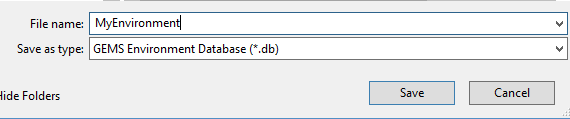

---
<!--
This section uses latex just because I wanted the title centered when
the doc is converted to PDF using pandoc.
-->

\begin{center}
\section{GEMS}

\subsection{Graphical Environment Management System Overview}

Travis L. Seymour, PhD 2019
\end{center}
---

### Goal

Create interactive virtual environments defined by a series of static
images and various interactions and dynamics.

### GEMSedit

The editor allows one to create or edit GEMS environments. Environments
are made of a **_views_**, which is a viewpoint onto anything that can
be depicted. E.g, a view might depict a doorway, or what it looks like
inside a room. It might also depict a closeup of an object, or a
depiction of what it’s like inside that object. It can literally be
anything that one can create an image of, including a bunch of text if
you want – although that might not be too exciting. To define an
environment, photograph, draw, or otherwise create or obtain an image
that corresponds to all the views you want to exist within the
environment and stitch them together using GEMSedit. Another
important thing one does with GEMSedit is to define **_objects,_**
which are rectangular sub-regions of view images. Although typically,
objects specify meaningful objects that are depicted in the view images
(e.g., a book, a cup, or a door), objects may also define areas or
sub-areas of a view image not necessarily tied to specific physical
objects within that view (e.g., a doorway, a hallway, the left side of a
room, or the top of a painting). Last, but not least, GEMSedit is
used to definite various environmental actions, interactions, and
consequences of those actions or interactions.

**Actions**. Actions are events that can occur in the environment as a
result of some action and optionally if some condition is met. For
example, you could specify that a sound effect (the **_action_**) if the
user left-clicks (the **_trigger_**) the mouse on a previously defined
object (the **_target object_**). Some actions are environmental, e.g.,
the passage of a certain amount of time, and others are based on user
actions (keyboard presses or mouse actions). Although user actions are
typically with regard to user-defined objects within some view, there
are special navigational actions as well. For example, you can define
what happens when the user clicks the left edge of the screen, e.g., you
might be taken to a new view. Objects with actions that lead to a view
change are called **_portals_**, and are typically in regard to some
user defined objects. But the left and right side of the screen are
special implicit objects one can design as triggers for some actions.
Although they are customarily used to allow the users to turn left or
right within some implied space, they don’t have to be used this way.

**Interactions**. Interactions are really just normal actions that
trigger as a result of one object being dragged (using the mouse
left-button) onto another object. This is a great way to increase the
richness of actions in the environment. For example, one could drag a
key object onto a locked door. This door could be specified to open or
portal to another view if clicked on **<u>after</u>** it has had the key
dropped onto it. Of course, this would require the environment to be
able to keep track of such occurrences. This is one of the uses for
**_variables_** within GEMS. An interaction like dragging a key onto a
door might result in setting the value of a new variable called
“door_unlocked” to True. Clicking the door could be set up to open (i.e,
portal to another view) if and only if there exists a variable called
“door_unlocked” that currently has the value True.

All actions have 3 required parts and 1 optional parts:

- **Trigger**. These define the event (environmental or user-action)
  that is required before an action will fire. An example of one
  environmental trigger is **TotalTimePassed**(_Seconds_) : This trigger
  fires when at least \<_Seconds_> seconds has passed since the current
  GEMS environment was started. An example of a user-action trigger is
  **MouseClick**() : This trigger fires whenever the mouse is
  left-clicked.

- **Action**. These define the action that occurs when a trigger occurs.
  For example, a common action portals the user to another view:
  **PortalTo**(_View_) : This action causes GEMS to load another view
  with the view ID of \<_View_>. If there is a working internet
  connection, you can cause text to be spoken with this action:
  **SayText**(_Message_) : This action causes GEMS to speak the given
  \<_Message_> using the Google’s text-to-speech API.

- **Enabled**. This is either the value _True_ or _False_. Setting this
  to _False_, allows an action to stay defined but not activated.

Actions can also have conditions, which are environmental states that
must be met in order for the action to be considered. Conditions are
optional, so if no condition is defined, then only the action’s trigger
determines when it activates. One common condition is
**ViewTimePassed**(_Seconds_) : This condition returns _True_ if at
least \<_Seconds_> seconds has passed since the current view was
displayed. Another common condition is **VarValueIs**(_Variable_,
_Value_) : This condition returns True if the user created token
\<_Variable_> exists and currently has the value \<_Value_>.

GEMS actions and interactions can be specified at various levels.

**Environment Actions**. Sometimes it is useful to specify some conditions,
triggers, and actions at the environmental level. These are actions that
occur no matter which view is currently active. There are only 2
triggers at this level: **TotalTimePassed**(_Seconds_) : This condition
returns True if at least \<_Seconds_> seconds has passed since the
current GEMS environment was started, and **KeyPress**(Key) : This
trigger fires when \<_Key_> is entered on the keyboard.

**View and Object Actions**. There are many actions that can be defined in
GEMS. Technically, the only real view-only action is one that triggers
on the **ViewTimePassed**. Otherwise, all actions are essentially based
on object-level actions and interactions. You can see a list of all the
conditions, actions, and interactions in the appendix.

**What you can do with objects in GEMS**. Remember that an object in
GEMS is just a rectangular region that the designer had designated as
such. There is no obligation to define everything in a view that is
visible as an object, but doing so allows some trigger (clicking,
hovering, dragging, etc.) relative to that object to have an effect (play
a song, portal to another view, speak some text, make some object
disappear). When you create a view, you have to at least specify a
**foreground picture** and a **background picture**. In some cases,
these will be the same image. However, if they are not the same,
interesting possibilities arise. For example, consider these foreground
and background images:

<!--
{ width=3.64in height=2.73in }
{ width=3.64in height=2.73in }
-->

{ width=50% height=25% }
{ width=50% height=25% }

If the designer specifies a foreground image that has some objects
depicted and a background image that is identical, except that those
objects are missing, then in the environment, several things become
possible. One is that the object can be specified as visible or hidden
and be revealed or hidden later as a result of some action or
interaction. In addition, if an object defined this way is dragged with
the mouse, it will appear as if it has been picked up and moved across
the screen. This illusion is created because when the object is dragged,
the location in which it was defined is quickly replaced with the same
region from the background. Note that for an object to be “_takeable_”,
it has to be specifically specified as such in GEMSedit. Otherwise, users
won’t be able to move it with the mouse. However, it could still be
hidden or revealed. Another powerful that that results from using the
on/off design for foreground and background images and specifying an
object as takeable is that it can be dragged a) onto other objects, and
b) into your pockets.

One of the many triggers available for objects is what happens if a
specific other object is dragged onto it. Making an object takeable
allows the designer to create interesting interactive possibilities. For
example, you might specify that if a toy is dragged onto a bin, it
disappears from the table. Thus, allowing users to clean up organize
objects. Programmatically, the object has just be marked as non-visible
as a result of an interaction type action. At the environment level,
several global options can be specified. One is how many (including 0)
pockets will be available. Pockets are icons that show up in the bottom
left corner of the display that look like denim jeans back pockets,
e.g.:

{ width=3.57156in height=0.88187in }

If a takeable object is dragged to a pocket, it will appear as if it is
dragged out of the environment and into the pocket:

{ width=3.55485in height=0.85104in }

Pockets allow users to collect objects and move them from one view to
another. Right-clicking a pocketed object will cause it to return to
its original location. If you wanted the user to drag the boots into a
box depicted in a view, you couldn’t change the foreground picture so
that it looked like the boots were now in it. However, you could do one
of 2 things: One you could have a depiction of the boots in the box in
the background image and (critically) within the same exact rectangular
space, have a version of the box without the shoes in the foreground
image. This way, dragging the shoes onto the empty box could be made to
result in the box object disappearing, revealing the boots-in-box region
on the background. One possible action in GEMS is to place an image from
the computer as an overlay of sorts on top of the foreground image.
Thus, another approach would be to specify that if the boots are dragged
onto the box object, that area could be covered by a small image just
depicting the boots in the box. Either way, the effect for the user
looks as if they have dragged the boots out of their pocket and into the
box, e.g.:

{ width=3.73632in height=1.43537in }
{ width=3.73928in height=1.42889in }

Automatically Portaling. Most often, moving from one view to another
happens a result of some user-initiated action or interaction. However,
portaling can also occur as a result of global timed events, or
view-level timed events. One use for global timed portals may be to
institute a deadline for interaction with a GEMS environment. For
example, maybe you want to take the user to a view with the words TIME’S
UP after 30 minutes. View level timers can be used to make things happen
relative to entering a view. For example, maybe after 2 minutes, if some
action has not been taken by the user, you could show a textbox
containing a clue, or portal to another view. Sometimes we use
view-level timed portaling to quickly move the user through a sequence
of views to establish a crude animation. This can be used to give the
user the sense of moving over a long distance, or be used to establish
the layout of a space. If, each of several views contained a
**ViewTimePassed** trigger set to go off .25 seconds after the view is
entered that fires a **PortalTo** action, then you could fly the user
from one point in a room to another. E.g.:

{ width=7.5in height=3.77083in }

Left-clicking on view #1 could automatically portal you through the
subsequent views until you stopped at view 5. This is animated in a way
that feels as if you are flying from the door, around the room, to the
table.

{ width=2.88472in height=2.17083in }

In the test environment depicted above, an interaction is defined in
view 5. If the dvd cover (which is not takeable in this case – we forgot
to take a picture without the dvd) is dragged onto the monitor, a little
video plays. Note that although the dvd is not takeable it is still
**_draggable_**. The downside of this arrangement is that the dvd will
not look as if it is being dragged, but the interaction will still work.

### Using GEMSedit

**Loading an existing GEMS Environment.** Gems environments consist of a
folder that contains an environment database file (e.g., kidsroom.db) and
a folder of media (pictures and audio files), named [ENVNAME]\_media,
e.g., kidsroom_media. To open an environment, press the OPEN ICON,
navigate to an environment folder, and choose the database file.

{ width=3.22662in height=1.15967in }

{ width=5.38726in height=1.58703in }

Global Environment Settings. There are several global settings.

{ width=3.22662in height=1.15967in }

{ width=3.98044in height=3.11027in }

**ID**: Hmm…I don’t know what this is?!

**Start View**: This defines the first view that will be loaded when the
environment starts. You change this to any existing view in the
environment.

**Pocket Count**: The number of pockets to feature in the environment

**View Transition**: This allows you to specify how GEMS transitions
from one view to the other. For now, this does nothing – views
transition via jump. Later, I hope to add a Fade transition and possibly
others.

**Preload Resources**: This is a currently non-implemented feature to
load all project media into memory for fast environment navigation. At
the moment this is not practical and has been disabled no matter what is
specified here.

**Global Overlay**: If a picture is specified here, it will be overlayed
onto the upper left corner of the environment for **_<u>every</u>_**
view. This cannot be changed while the environment is running and may
have limited use cases. For a flexible overlay, you’ll notice that when
designing view, you can specify a view-level overlap that can be
different from one view to the next. We’ve used this for a dynamically
updating map of where one is in an environment. E.g.:

{ width=1.78508in height=1.24415in }

**Version:** This field will go away soon. Ignore it.

**Stage Color**: Hopefully you won’t have to deal with this. The size of
the environment is dictated by the **StartView’s foreground picture**.
Any subsequent view that uses foreground/background smaller than this
will result in a colored background showing the extent of the area not
used. This setting specifies the color of that region. Make all of your
view images the same size to avoid this situation!

**Display Type**: Can be either Windowed or FullScreen. Windowed mode is
nice for designing because one will also need to manage media files.
However, for a more immersive experience, switch to FullScreen. Note:
The most recent version of GEMS needs significant testing in FullScreen
mode – it has mostly been set to Windowed for development and testing.

**Object Hover**: This dictates what happens when someone hovers over a
region defined as an object. The options are ChangeCursor (the cursor
switches from white to yellow alerting the user that this object is
defined), FrameObject (draws a yellow rectangle around the boundaries of
the object), and ShowName (puts the objects name in yellow at the bottom
left of its bounding box). The Object Hover option also allows
combinations such as Frame+Cursor, Name+Cursor, and Cursor+Frame+Name.
Most of these permutations were created for designing environments, but
ChangeCursor may be a useful user facing ui choice.

---

### Running a GEMS Environment.

To run a loaded environment, just click on the run icon:

{ width=3.22662in height=1.15967in }

{ width=4.52091in height=4.1337in }

The **Environment Database File** is not editable and will be set to
whatever environment is currently loaded into the editor. GEMS is
designed to save data about everything that happens during a run, a user
id can be used to distinguish data from multiple users. If this is left
at its default, it will always use “User1” as the user id. You can
toggle whether to actually save the data and whether to overwrite or
rename an existing data file for a particular user. Media playback can
be disabled when quiet operation is desired. Debug mode use helpful
during environment design because it shows the current status of any
defined environment variables. E.g.:

{ width=2.54696in height=1.6453in }

{ width=2.45558in height=1.65297in }

This information floats in the upper left hand corner when Debug Mode is
enabled.

Finally, press the Launch GEMS Runner button to start. To stop, press
ESCAPE (e.g., in FullScreen Mode) or click the red close-window icon
(e.g., in Windowed Mode).

---

### Creating a New GEMS Environment.

1. Press the NEW button\
   { width=3.22662in height=1.15967in }

2. Navigate to where you want the environment folder to be created
   (e.g., Desktop) and type in a name of your project (no extension).
   For example, enter “MyEnvironment” and press **SAVE**.\
   { width=5.61718in height=1.17285in }

3. You will notice that GEMS creates a new environment with 2 default
   views (StartRoom and EndRoom). A couple of objects and interactions
   have been defined. You can delete these and specify your own
   environment.

4. Click the **MediaFolder** icon to open your media folder.\
   { width=3.22662in height=1.15967in }

5. Do not bother the files already here. Some of them are needed for
   GEMS operation. Dump all the images and sound files (e.g., .png or
   .jpg image files, and .mp3 or .ogg audio files. Many formats are
   supported). You will need for your environment here. Then you will
   be ready to stitch them all together to form your environment.

6. I suggest you plan out your environment on paper first. Which views
   will you use and to which other views could a user portal from each
   view.

7. Next it’s time to take pictures. Use a tripod and try to have as
   little difference as possible (i.e., no difference) between the
   camera position when taking foreground and background images for a
   particular view. You want to avoid lighting differences as well –
   keep track of how your own location in the room alters the light.
   Planning is key, if you have to go back later to get another shot,
   the lighting may be very different.

8. If you already know which sounds you want, obtain them or record them
   to .wav or .mp3 and copy them to your media folder as well. Note:
   All pictures and sound files go into the root of your media folder.
   Don’t create any sub-folders.

9. Once you have a plan, and your media, you’re ready to edit your
   environment.

---

### Defining and Editing Views

{ width=7.5in height=4.60625in }

1. These icons allow you to create a new empty view, or delete the
   currently selected view in the list, respectively. Be careful with
   deleting views – this cannot be undone. Also make sure you have
   selected the view you really want to delete. Adding a new view
   requires only a new view name. It is possible to have multiple views
   with the same name – we do not recommend this.

2. The folder icon lets you specify a foreground picture from those in
   your media folder. The arrow icon copies the value from the current
   background picture. The red X deletes the current picture entry
   (this does not affect the image file on disk).

3. Same as #2, but for the background picture. The blue arrow will
   make the current background the same image currently used for the
   foreground. **Please ensure that all view foreground and background
   pictures the exact same dimensions or odd things can result. In a
   few use cases, this might be desirable, but not usually.**

4. Select or delete an overlay picture. This picture will be displayed
   relative to the upper right corner of the view. This overlay could
   be as large as the foreground and background pictures, but for many
   use cases, it will be somewhat smaller. E.g., a map, or special
   message.

5. All the windows on this row show a depiction of which image is
   currently selected. If you click on this window, you will be able to
   view a full size version. Hit the ENTER key to return.

6. Click the green plus to create a new empty action. All cells will
   initially turn red to indicated that now enough information has been
   supplied for it to actually work. This will change when you’re
   entered at least a trigger, action (the condition is optional). The
   red X will permanently delete the currently selected action. Please
   be careful that you have selected the appropriate view action and
   that you really want to delete it. This cannot be undone. It may be
   wiser to disable an action than to delete it if you think you may
   want to use re-enable it later.

7. Clicking on either the Condition, Trigger, Action, or Enabled cells
   allows you to specify their contents for that action. This occurs
   via dialogs that pop up when you click each cell. For example,
   clicking the Condition, Trigger, and Action cells will pop up
   dialogs like these:\
   { width=3.30183in height=3.08262in }
   { width=3.29191in height=3.0883in }
   { width=3.30202in height=3.08739in }

8. This button is used to open a new screen that allows the design and
   specification of objects for this view. Make sure you have specified
   your foreground and background pictures before creating objects.

---

### Defining and Editing View Objects

{ width=7.5in height=4.85208in }

1. Similar to with the view editor, these buttons allow you to add
   define new objects, or remove previous object definitions. Be
   careful, deletions cannot be undone.

2. Objects are simply sub-regions of your existing foreground image. So
   clicking the lasso tool here allows you to define your object as a
   rectangular. The two image regions below #2 and to the right of it
   (Object Location View) show you the selected region in context and
   in a magnified fashion. Pressing the red X button will allow you to
   clear out the object picture selection.

3. This checkbox determines whether this object will be marked as
   visible, and thus whether it will show up when the environment is
   run. Actions and interactions can result in this being toggled.

4. “Takeable” refers to whether or not this object is meant to be
   removed from its default location and potentially dragged to the
   pockets for transport across views. If you define an object as
   takeable, you really should make sure that it is not visible in the
   background image. This will lead to the most natural effect when
   users drag it out of position within the environment. An exception
   to this may be a stack of paper where you want the user to appear to
   have taken a sheet of paper while leaving the stack in place.

5. Just like at the view level, these buttons allow you to add or
   remove actions.

6. Just like at the view level (and using the same dialogs shown
   above), this list allows you to manipulate the conditions, triggers,
   and consequences of each defined action.

### Other Thoughts

1. You don’t have to save anything…all changes are saved to you
   environment database immediately.

2. If you want to move around or share your environment, everything
   will be in your project folder. Essentially your xxxxxx.db file and
   the xxxxxx_media folder.

3. You may need to learn about basic photo editing to manage images
   that are too big, or are of different sizes. Same idea for basic
   audio editing for controlling volume and cropping.

---

### APPENDIX

#### CONDITIONS

- **Blank** : No condition is set.

- **VarValueIs**(`Variable`,`Value`) : This condition returns true if the
  user created token Variable exists and currently has the value `Value`.

- **VarValueIsNot**(`Variable`,`Value`) : This condition returns true if the
  user created token Variable currently does not have the value `Value` or
  does not exist.

- **VarExists**(`Variable`) : This condition returns true if the user
  created token Variable currently exists.

- **ViewTimePassed**(`Seconds`) : This condition returns true if at least
  `Seconds` seconds has passed since the current view was displayed.

- **TotalTimePassed**(`Seconds`) : This condition returns true if at least
  `Seconds` seconds has passed since the current GEMS environment was
  started.

- **VarCountEq**(`Count`) : This condition returns true if the number of
  user created variables equals Count.

- **VarCountGtEq**(`Count`) : This condition returns true if the number of
  user created variables is greater than or equal to Count.

- **VarCountLtEq**(`Count`) : This condition returns true if the number of
  user created variables is less than or equal to Count.

- **KeyBufferContains**(String) : This condition returns true when the
  keyboard buffer contains the characters in Keys. Use only these
  characters: [a-zA-Z0-9 -\_./]It is recommended that the action
  **ClearKeyBuffer**() precede use of this condition.

#### TRIGGERS

- **Blank** : No trigger is set.

- **ViewTimePassed**(`Seconds`) : This trigger fires when at least `Seconds`
  seconds has passed since the current view was displayed.

- **TotalTimePassed**(`Seconds`) : This trigger fires when at least
  `Seconds` seconds has passed since the current GEMS environment was
  started.

- **MouseClick**() : This trigger fires whenever the mouse is
  left-clicked.

- **DroppedOn**(`Object`) : This trigger fires when Object is dragged and
  then dropped onto the associated object.

- **KeyPress**(`Key`) : This trigger fires when Key is entered on the
  keyboard.

- **NavLeft**() : This trigger fires whenever the mouse is left-clicked
  towards the Left edge of the screen.

- **NavRight**() : This trigger fires whenever the mouse is left-clicked
  towards the Right edge of the screen.

- **NavTop**() : This trigger fires whenever the mouse is left-clicked
  towards the Top edge of the screen.

- **NavBottom**() : This trigger fires whenever the mouse is
  left-clicked towards the Bottom edge of the screen.

#### ACTIONS

- **Blank** : No action is set.

- **PortalTo**(`View`) : This action causes GEMS to load View.

- **PlaySound**(`SoundFile`,`Start`,`Volume`,`Loop`) : This action instructs
  GEMS to play the audio in SoundFile. The soundfile beings playing at
  Start seconds [Default = 0 = beginning] and plays at the desired
  Volume [0.0 to 1.0]. If Loop is "True" [default = "False"], the
  soundfile will loop continually.

- **PlayVideo**(`VideoFile`,`Start`,`Left`,`Top`,`WithinObject`) : This action
  instructs GEMS to play the video in VideoFile at position
  (Left,Right). The soundfile beings playing at Start seconds \[Default
  = 0 = beginning\]. If WithinObject refers to a currently visible
  object, the video will play within that object's boundary. Otherwise,
  the video will play fullscreen. **[broken…only audio plays?!]**

- **ShowImage**(`ImageFile`,`Left`,`Top`,`Duration`,`Clickthrough`) : This action
  loads and displays ImageFile at (Left,Top) for Duration seconds
  [default = 0 = forever]. The image is removed when the view is
  changed. If `Clickthrough` is "True" [default = "False"], clickable
  objects \<em>under\</em> the image will continue to fire associated
  actions. Note: ShowImage <u>can play animated gif images</u>!

- **ShowImageWithin**(`ImageFile`,`Left`,`Top`,`Duration`,`Clickthrough`,`WithinObject`,`HideTarget`,`Stretch`) : This action loads and displays `ImageFile`. If `WithinObject` matches a valid object, the image is scaled to that object’s bounds (aspect preserved by default; centered when `Stretch` is "True") and positioned over it; otherwise it is placed at (`Left`,`Top`). The image is removed when the view is changed. If `HideTarget` is "True" [default = "False"], the target object is hidden while the image is shown (restored after `Duration` if provided). If `Clickthrough` is "True" [default = "False"], clickable objects under the image will continue to fire associated actions. Note: ShowImageWithin can play animated gif images.

- **RunProgram**(`Application`,`Parameters`) : This action caused GEMS
  execute Application with the optional Parameters.

- **SayText**(`Message`) : This action causes GEMS to speak the given
  Message using the default voice.

- **TextBox**(`Message`,`Left`,`Top`,`Duration`,`FontColor`) : This action causes
  GEMS to draw a textbox over the view containing the text in Message.
  The message will be positioned at Left pixels from the left and Top
  pixels from the top of the view. After Duration seconds \[default = 0
  = forever\], the textbox will be removed. Set FontColor as desired.

- **TextDialog**(Message) : This action causes GEMS to display an input
  dialog box containing Message. The dialog box will remain until the
  user presses the SUBMIT button.

- **InputDialog**(`Prompt`,`Variable`) : This action causes GEMS to display
  an input dialog box containing the query Prompt. The dialog box will
  remain until the user presses the SUBMIT button. The entered text will
  be associated with the user variable `Variable`.

- **ShowURL**(`URL`) : This action shows a custom browser window and loads
  the page at the supplied URL. The window remains atop the GEMS
  environment until dismissed by the user (close button).

- **HideObject**(`Object`) : This action causes GEMS to make invisible the
  object identified as Object.

- **ShowObject**(`Object`) : This action causes GEMS to make visible the
  object identified as Object.

- **AllowTake**(`Object`) : This action causes GEMS to make takeable the
  object identified as Object.

- **DisallowTake**(`Object`) : This action causes GEMS to remove the
  takeable property of the object identified as Object.

- **ChangeCursor**(`Cursor`) : This action causes GEMS to change the mouse
  cursor to Cursor.

- **SetVariable**(`Variable`,`Value`) : This action set the user created
  token Variable to Value. If Variable does not exist, it will be
  created first.

- **DelVariable**(`Variable`) : This action removes the user created token
  Variable.

- **ClearKeyBuffer**() : This action clears all characters in the
  keyboard buffer.

- **Quit**() : This action terminates the current GEMS environment.

- **HideMouse**() : This action hides the mouse cursor.

- **UnhideMouse**() : This action un-hides the mouse cursor. \[does this
  work?!\]

- **HidePockets**() : This action hides all active pockets.

- **ShowPockets**() : This action un-hides all active pockets.
